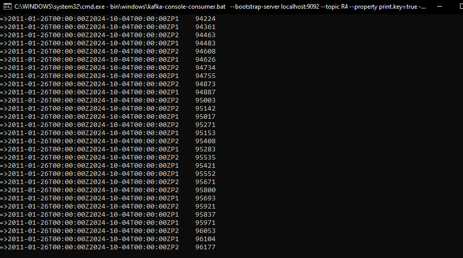

# Objectif :
En Utilisant KAFKA et Stpring Cloud Streams, Créer :
- Un Service Producer KAFKA via un Rest Controler
- Un Service Consumer KAFKA
- Un Service Supplier KAFKA
- Un Service de Data Analytics Real Time Stream Processing avec Kaflka Streams
- Une application Web qui permet d'afficher les résultats du Stream Data Analytics en temps réel

# Screens:

 